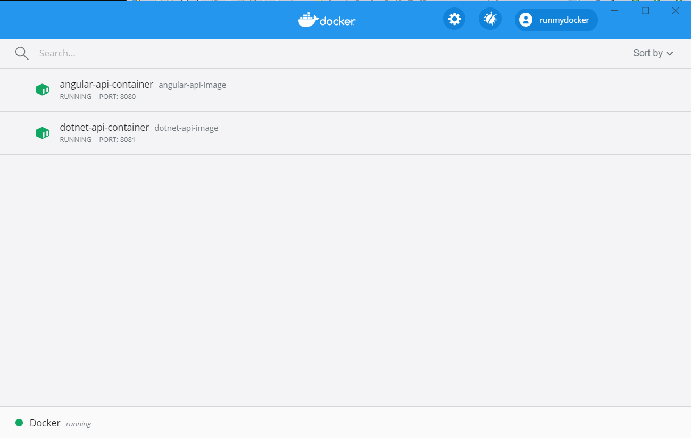

:angular_version: current
:dotnet_version: current
:toc:
:project_id: task-tracking
:icons: font
:source-highlighter: prettify

= Welcome to task-tracking !

Description of the project: a User sets up a new Task in the calendar week.
When the Week is still open, other Tasks can be added.
This is a demo to see how an Angular Application views a Dotnet Application.

[[initial]]
== Set up Angular App and .NET App

after downloading from git:

- build Angular image:

[subs="attributes"]
----
./cd angular-api
./npm install @angular/cli
./ng build --aot --output-hashing=all
./docker build -t angular-api-image .
./docker images
----

you can see

[subs="attributes"]
----
REPOSITORY          TAG                 IMAGE ID            CREATED             SIZE
angular-api-image   latest              afe501b7f54c        40 seconds ago      38.4MB
nginx               1.17.1-alpine       ea1193fd3dde        12 months ago       20.6MB
----

finally you run the image

[subs="attributes"]
----
./docker run --name angular-api-container -d -p 8080:80 angular-api-image
----

- build .NET image:

[subs="attributes"]
----
./cd DotNetApi
./dotnet publish
./docker build -t dotnet-api-image -f Dockerfile .
./docker images
----

you can see

[subs="attributes"]
----
REPOSITORY                             TAG                 IMAGE ID            CREATED             SIZE
<none>                                 <none>              c41340a5ad8e        32 seconds ago      790MB
dotnet-api-image                       latest              0282629a5076        32 seconds ago      208MB
angular-api-image                      latest              afe501b7f54c        11 minutes ago      38.4MB
mcr.microsoft.com/dotnet/core/sdk      3.1-buster          006ded9ddf29        13 days ago         705MB
mcr.microsoft.com/dotnet/core/aspnet   3.1-buster-slim     014a41b1f39a        13 days ago         207MB
nginx                                  1.17.1-alpine       ea1193fd3dde        12 months ago       20.6MB
----

finally you run the image

[subs="attributes"]
----
./docker run --name dotnet-api-container -d -p 8081:80 dotnet-api-image
----

if you have problems to build, I suggest you to clean all Docker images:

[subs="attributes"]
----
./docker system prune -a
----

[[initial]]
=== Screenshot

== Architecture description

The Architecture is based on two main layers:
- 1) Angular App for Front End (FE) to manage the dashboard in a Single Page Application (SPA);
- 2) Dotnet Core App for Back End (BE) to manage the REST Microservices (API);

=== Angular Architecture description

The dashboard consists of three main components, a service for invoking the DotNet API and all the management of CSS styles.

==== Angular Color description

In Angular the dynamic coloring of the Task occurs through a "Color Queue Manager" called "QueueColor<T>".
In QueueColor<T> we have four main operations:
- next(): Node<T>, to retrieve the next element in a circular queue;
- enqueue(data: T): void, to inject a new color;
- dequeue(): T, to remove an old color;
- isEmpty():, to check if the queue has colors again;

==== Angular Custom Pipe description

A Custom Pipe called "MyPipe" is a class that inherits from PipeTransform.
Its function is to process a string and return it with an expression enclosed by two square brackets to highlight the name of the Task.

==== Angular Model and Service description

A Service called "ButtonsService" is responsible for handling incoming and outgoing DotNet API calls through the interface model called "ApiDataInterface":
- id: unique identifier to retrieve the data from DB;
- task: the name of the Task to assign;
- color: the color of the Task;
- dayStart: is a number that goes from 0 to 6, corresponds to the days of the week;
- dayEnd: is a number that goes from 0 to 6, corresponds to the days of the week. This number cannot be less than the start date.

The operators of "ButtonsService":
- initColors(): the method initializes the color queue (it is invoked by the constructor);
- add(): the method adds a new Task in memory;
- clear(): the method cleans the weekly plan;
- load() / get(): call the DotNet API MyAPI/get returning an Observable type interface;
- save() / put(): call the DotNet API MyAPI/put with the control of the Subscriber if the call goes wrong;

==== other Angular Components description

- buttons.component: rendering of the button panel that calls the ButtonsService and
MyPipe;
- my-input.component: rendering of the input panel;
- task-color: Task style rendering;

== .NET Architecture description

The architecture is developed on API controller, payload model and CORS configuration.

- MyAPIController: handles API calls;
- ApiDataClass: API model;
- Startup.cs: CORS configuration;
- Program.cs: initializes the application;
- Dockerfile: the Docker configuration;

